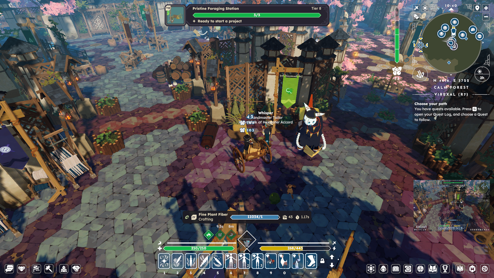

# BUG-025: Station Job Progress Bar Distorts Max Value to 1 on Buff Activation or Expiration

## Problem Description
When actively working on a station job (e.g., crafting *Fine Plant Fiber* at a Foraging Station), triggering or expiring a profession-related buff—such as the *Preserved Mushroom Buff*—temporarily distorts the active progress bar UI.

Upon status effect activation or deactivation, the max effort value of the progress bar incorrectly resets to **1** for several seconds while retaining the total numerical effort already completed (e.g., displaying **11034/1**). This causes the visual progress bar to completely overfill until the client updates the recalculated target effort value.

---

## Steps to Reproduce
1. Begin a crafting project at a station (e.g., T4 *Fine Plant Fiber* in a Foraging Station).
2. Consume a buff item or trigger a profession buff on hit (e.g., *Preserved Mushroom Buff*).
3. Observe the crafting progress bar HUD at the moment the buff status changes (activation or deactivation).
4. Note that the progress bar momentarily displays `[Current Effort] / 1` (e.g., `11034/1`), distorting the visual completion indicator.

---

## Expected vs. Actual Result

| Type | Result |
| :--- | :--- |
| **Expected Result** | The progress bar should smoothly update its total required effort integer according to active stat modifiers without resetting the denominator to `1`. |
| **Actual Result** | The progress bar denominator temporarily defaults to `1` (e.g., `11034/1`), overfilling the visual UI bar until the server syncs the updated total effort requirement. |

---

## Technical Observations & Potential Causes
* **Stat Recalculation Race Condition:** When a player's active efficiency/speed stats change mid-craft, the UI client may momentarily unbind or clear the target total effort variable (`maxEffort = 1` or fallback default) while fetching the updated server-side recipe parameters.
* **Asynchronous Buff Event Handler:** The event handler that recalibrates remaining effort upon buff state changes processes `currentProgress` before `totalRequiredProgress` is re-bound, leading to a temporary visual division by 1.

## Screenshot

