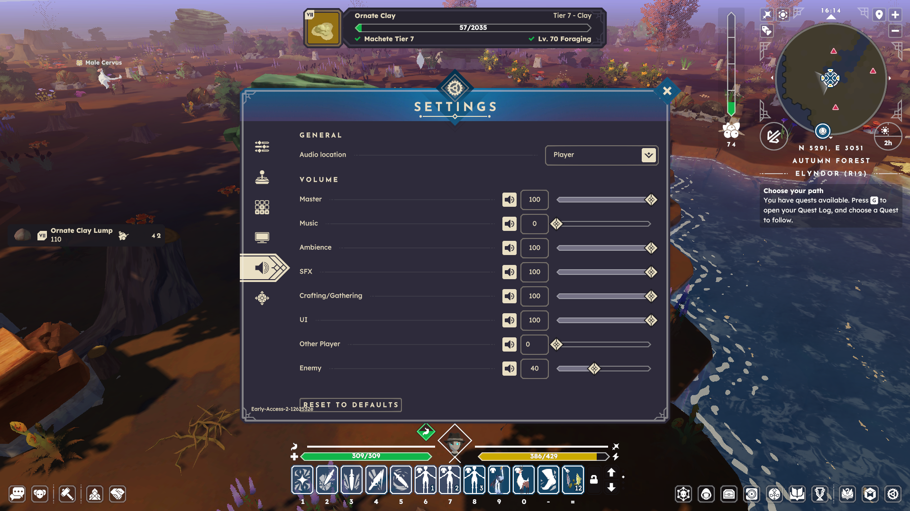

---
AIGC:
    Label: "1"
    ContentProducer: 001191440300708461136T1XGW3
    ProduceID: 89238829fb97168b9c4195c03c152aef_70de5665bf6211f197eb525400393706
    ReservedCode1: J1quc/ACAJ0Deh5h9gpmJo7lD4naSQkBwBSP1qT15gph/4uVW1ra9vzWs73xZVzxUCmcz0TWftBfubn70MM9ijSV1Zz3xuvS8GRy8bGL1Sb47WEaMrmNv95TQtiTSUT8gDNhDnI2fAeLhO3wG86zvI8oRgYI+n+f/yS6v0R+LRY4MVOoQKFW2LXFDog=
    ContentPropagator: 001191440300708461136T1XGW3
    PropagateID: 89238829fb97168b9c4195c03c152aef_70de5665bf6211f197eb525400393706
    ReservedCode2: J1quc/ACAJ0Deh5h9gpmJo7lD4naSQkBwBSP1qT15gph/4uVW1ra9vzWs73xZVzxUCmcz0TWftBfubn70MM9ijSV1Zz3xuvS8GRy8bGL1Sb47WEaMrmNv95TQtiTSUT8gDNhDnI2fAeLhO3wG86zvI8oRgYI+n+f/yS6v0R+LRY4MVOoQKFW2LXFDog=
---

# BUG-026: Other Player Volume Entry Lacks Numeric Display and Value Renders Left-Aligned Until Audio Panel Is Reopened

## Problem Description
In the in-game **Settings → Audio (VOLUME)** panel, the **Other Player** volume entry does not display its numeric value initially, while every other volume entry (Master, Music, Ambience, SFX, Crafting/Gathering, UI, Enemy) shows its current value normally.

When the user inputs a new number into the field, the typed value appears on the **left side** of the value display area instead of the centered position used by the other entries. Closing and reopening the Audio settings panel temporarily restores the correct centered numeric display, which indicates the issue is a client-side UI state/render problem rather than a value-binding failure.

---

## Steps to Reproduce
1. Open **Settings** and switch to the Audio / Volume section.
2. Locate the **Other Player** volume entry (the seventh slider in the VOLUME list).
3. Observe that its numeric value box is empty, while all other entries display values (e.g., Master: 100, SFX: 100, Enemy: 40).
4. Click the numeric field and type a new value (e.g., `50`).
5. Observe that the typed number renders on the **left** side of the value display area, visually misaligned relative to the centered values of the other entries.
6. Close the Audio settings panel and reopen it.
7. Observe that the value now displays correctly and centered — until the panel is closed and reopened again under the same conditions.

---

## Expected vs. Actual Result

| Type | Result |
| :--- | :--- |
| **Expected Result** | The **Other Player** volume entry should always display its numeric value in the centered layout used by all other volume entries, both on first open and after user input. |
| **Actual Result** | The numeric display is empty on first render; after typing, the value appears left-aligned instead of centered. The display only normalizes after the Audio settings panel is closed and reopened. |

---

## Technical Observations & Potential Causes
* **Incomplete Initial Value Binding:** The **Other Player** volume entry appears to initialize without a bound numeric label, causing the value box to render empty until the user interacts with it or the panel is re-laid out.
* **Text Alignment State Not Refreshed on First Render:** The numeric label's alignment (or the input field's anchor point) may default to left-aligned for this specific entry and only be corrected by the layout pass triggered when the panel is reopened — consistent with the value appearing left of the expected centered slot.
* **Entry-Specific UI Template Path:** Unlike sibling entries, **Other Player** may be populated through a different/lazily-instantiated template (e.g., populated only after the master volume group initializes), leaving its text alignment and visibility state stale until a full panel reload.

## Screenshot

*（内容由AI生成，仅供参考）*
