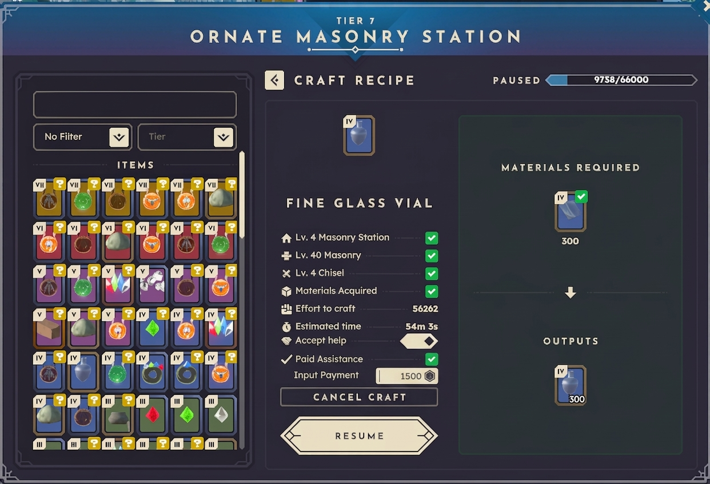

# FB-016: Implement Automated Reward Escrow and Effort-Proportional Payouts for Collaborative Crafting

## Problem Description
Currently, when a player assists another character with long crafting queues, the contributor receives only skill experience points. 

If an item owner wants to hire help or offer a monetary incentive to speed up a large crafting project, there is no native, scam-proof system to manage payment. Furthermore, when multiple players contribute to the same crafting station, the game provides no built-in breakdown of each participant's progress percentage. Determining fair compensation requires using external tools like *Bitjita* to manually calculate individual effort and distribute payments, creating friction and risk of trade disputes.

---

## Proposed Solution
Enhance the crafting station interface with a native, automated payment escrow and contribution-tracking system:

1. **"Paid Assistance" Toggle & Escrow Field:** When enabling "Accept Help" on a crafting queue, allow the item owner to enable a "Paid Assistance" option and set a total Hex Coin reward budget. This budget is locked in escrow from the owner's balance.
2. **Real-Time Effort-Proportional Payouts:** Automatically calculate crafting labor/progress contributed by assisting players and distribute the escrowed funds dynamically as work is completed.
3. **Partial Progress Distribution:** Ensure contributors receive their proportional cut immediately based on stamina/time invested, eliminating the need to wait for the entire crafting batch to finish or manually calculate shares.

---

## User Experience & Value
* **Scam-Proof Player Economy:** Provides a secure, automated framework for commissioning labor and paying assistants without relying on trust-based manual trades.
* **Fair & Granular Compensation:** Accurately rewards multiple contributors according to their exact effort, incentivizing community help on massive crafting projects.

---

## Screenshot

---
